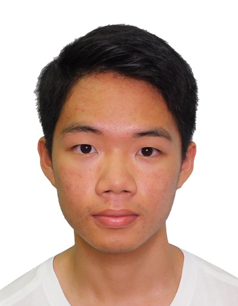

We are a team based in the [School of Computing, National University of Singapore](https://www.comp.nus.edu.sg).

You can reach us at the email `seer[at]comp.nus.edu.sg`

## Project team

### Isaac Lai Yin Chung

[[github](https://github.com/eyexactly)]
[[portfolio](team/johndoe.md)]

* Role: Developer
* Responsibilities: Documentation, Testing, Logic 

### Lim Kian Ian

[[github](https://github.com/BoredFurry)]
[[portfolio](team/johndoe.md)]

* Role: Integration, Scheduling and Tracking
* Responsibilities: Model, Storage

### Zaki

[[github](http://github.com/puntart)] 
[[portfolio](team/puntart.md)]

* Role: Team Lead
* Responsibilities: Deliverable and deadlines, Code quality, ui, commons, IntelliJ expert